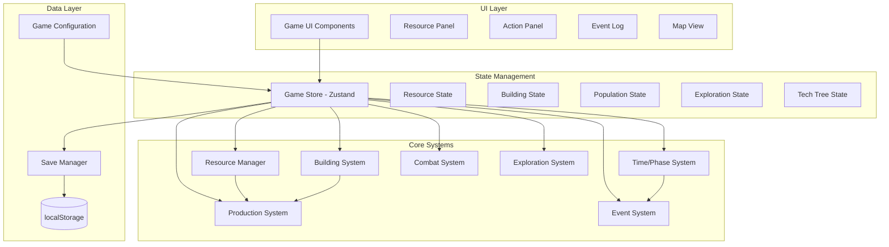

# Design Document: 尘埃与回响 (Dust & Echoes)

## Overview

《尘埃与回响》是一款废土生存网页文字游戏，采用React + TypeScript技术栈，使用Zustand进行状态管理。游戏以行动阶段为核心循环，玩家通过即时操作管理资源、建设基地、探索废土世界。

### 核心设计原则

1. **价值统一性**: 所有资源、物品、建筑都基于VU (Value Unit) 价值体系，1 VU = 1 Scrap
2. **行动阶段制**: 一天6个阶段（5 AU），玩家主动推进时间
3. **数学平衡**: 净盈余 = 15 VU/AU (产出) - 10 VU/AU (消耗) = 5 VU/AU/人
4. **渐进解锁**: 通过科技树和建筑等级逐步开放游戏内容

## Architecture

### 技术栈

- **前端框架**: React 18 + TypeScript
- **状态管理**: Zustand (轻量级，适合游戏状态)
- **样式方案**: Tailwind CSS (快速构建复古终端UI)
- **数据存储**: localStorage (自动存档) + JSON序列化
- **构建工具**: Vite

### 系统架构图



## Components and Interfaces

### 核心数据类型

```typescript
// 时间阶段
type Phase = 'dawn' | 'morning' | 'noon' | 'afternoon' | 'evening' | 'midnight';

interface TimeState {
  day: number;
  phase: Phase;
  phaseAU: number; // 当前阶段的AU值 (0.5 或 1.0)
}

// 资源类型
type ResourceId = 
  // 一级资源
  | 'scrap' | 'water' | 'dirty_water' | 'food' | 'raw_meat' | 'canned_food' | 'vegetables' | 'seeds' | 'fertilizer'
  // 二级材料
  | 'wood' | 'metal' | 'cloth' | 'leather' | 'plastic' | 'glass' | 'rubber' | 'wire' | 'rope' | 'duct_tape'
  // 组件
  | 'gear' | 'pipe' | 'spring' | 'bearing' | 'fasteners'
  // 化工
  | 'solvent' | 'acid' | 'gunpowder' | 'fuel'
  // 能源组件
  | 'battery_cell' | 'battery_pack' | 'filter' | 'seal_ring'
  // 三级稀有
  | 'meds' | 'data_tape' | 'radio_parts' | 'solar_cell' | 'rare_alloy' | 'microchips' | 'nanofiber' | 'power_core';

interface Resource {
  id: ResourceId;
  name: string;
  nameZh: string;
  vu: number; // 价值单位
  category: 'primary' | 'secondary' | 'component' | 'chemical' | 'energy' | 'rare';
  perishable?: boolean; // 是否易腐
  stackLimit?: number;
}

// 配方
interface Recipe {
  id: string;
  output: { resourceId: ResourceId; amount: number };
  inputs: { resourceId: ResourceId; amount: number }[];
  workRequired: number; // Work点数
  unlockTech?: string; // 解锁科技
  unlockBuilding?: string; // 解锁建筑
}

// 建筑
type BuildingId = 
  | 'bonfire' | 'shelter' | 'warehouse' | 'workshop' | 'radio_tower'
  | 'water_collector' | 'trap' | 'scavenge_post'
  | 'greenhouse' | 'research_desk' | 'generator' | 'solar_panel' | 'battery_bank'
  | 'training_ground' | 'map_room' | 'vanguard_camp';

interface Building {
  id: BuildingId;
  name: string;
  nameZh: string;
  maxLevel: number;
  costs: BuildingCost[]; // 每级成本
  effects: BuildingEffect[];
  unlockTech?: string;
}

interface BuildingCost {
  level: number;
  resources: { resourceId: ResourceId; amount: number }[];
  totalVU: number;
}

interface BuildingEffect {
  level: number;
  type: 'unlock_job' | 'increase_cap' | 'efficiency_bonus' | 'unlock_recipe' | 'unlock_region';
  value: any;
}

// 人口与岗位
type JobId = 'scavenger' | 'water_collector' | 'hunter' | 'engineer' | 'guard' | 'scout' | 'researcher';

interface Worker {
  id: string;
  name: string;
  health: number; // 0-100
  job: JobId | null;
  statuses: StatusEffect[];
  equipment: {
    weapon?: string;
    armor?: string;
    tool?: string;
  };
}

interface StatusEffect {
  type: 'bleed' | 'infection' | 'poisoned' | 'radiation';
  severity: 'light' | 'medium' | 'severe';
  duration?: number; // AU remaining
}

// 装备
interface Equipment {
  id: string;
  type: 'weapon' | 'armor' | 'tool';
  name: string;
  nameZh: string;
  durability: number;
  maxDurability: number;
  stats: EquipmentStats;
  craftRecipe?: Recipe;
  vu: number;
}

interface EquipmentStats {
  atk?: number;
  def?: number;
  efficiency?: number; // 效率加成
  special?: string[]; // 特殊效果
}

// 探索
type RegionTier = 'T0' | 'T1' | 'T2' | 'T3' | 'T4' | 'T5';

interface MapNode {
  id: string;
  name: string;
  nameZh: string;
  tier: RegionTier;
  distance: number; // 距离基地的AU
  state: 'undiscovered' | 'discovered' | 'explored' | 'cleared';
  riskCoefficient: number;
  lootTable: LootEntry[];
  events: string[];
}

interface LootEntry {
  resourceId: ResourceId;
  minAmount: number;
  maxAmount: number;
  probability: number;
}

// 科技树
interface Technology {
  id: string;
  name: string;
  nameZh: string;
  tier: 'T1' | 'T2' | 'T3' | 'T4';
  branch: 'building' | 'agriculture' | 'industry' | 'civic' | 'exploration';
  rpCost: number;
  materialCost?: { resourceId: ResourceId; amount: number }[];
  prerequisites: string[];
  unlocks: TechUnlock[];
}

interface TechUnlock {
  type: 'building' | 'recipe' | 'job' | 'region' | 'feature';
  id: string;
}
```

### 状态管理 (Zustand Store)

```typescript
interface GameState {
  // 时间状态
  time: TimeState;
  
  // 资源状态
  resources: Record<ResourceId, number>;
  resourceCaps: Record<ResourceId, number>;
  
  // 建筑状态
  buildings: Record<BuildingId, { level: number; state: 'idle' | 'active' }>;
  
  // 人口状态
  population: {
    workers: Worker[];
    cap: number;
    morale: number; // -5 to +5
  };
  
  // 岗位分配
  jobs: Record<JobId, string[]>; // job -> worker ids
  
  // 装备库存
  equipment: Equipment[];
  
  // 探索状态
  exploration: {
    mapNodes: MapNode[];
    activeExpedition: Expedition | null;
    outposts: Outpost[];
  };
  
  // 科技状态
  tech: {
    researched: string[];
    current: string | null;
    progress: number;
  };
  
  // 事件日志
  eventLog: EventLogEntry[];
  
  // 游戏设置
  settings: GameSettings;
}

// Actions
interface GameActions {
  // 时间
  advancePhase: () => void;
  
  // 资源
  addResource: (id: ResourceId, amount: number) => void;
  consumeResource: (id: ResourceId, amount: number) => boolean;
  
  // 建筑
  buildOrUpgrade: (id: BuildingId) => boolean;
  setBonfireIntensity: (intensity: 'off' | 'low' | 'medium' | 'high') => void;
  
  // 人口
  assignJob: (workerId: string, jobId: JobId | null) => void;
  healWorker: (workerId: string, itemId: string) => void;
  
  // 制造
  craft: (recipeId: string) => boolean;
  
  // 探索
  startExpedition: (nodeId: string, workerIds: string[]) => boolean;
  resolveExpedition: () => void;
  
  // 科技
  startResearch: (techId: string) => boolean;
  
  // 存档
  saveGame: () => void;
  loadGame: () => boolean;
  exportSave: () => string;
  importSave: (data: string) => boolean;
}
```

## Data Models

### 资源配置数据

```typescript
const RESOURCES: Record<ResourceId, Resource> = {
  // 一级资源
  scrap: { id: 'scrap', name: 'Scrap', nameZh: '废料', vu: 1, category: 'primary' },
  water: { id: 'water', name: 'Water', nameZh: '净水', vu: 5, category: 'primary' },
  dirty_water: { id: 'dirty_water', name: 'Dirty Water', nameZh: '脏水', vu: 3, category: 'primary' },
  food: { id: 'food', name: 'Food', nameZh: '口粮', vu: 4.167, category: 'primary' },
  raw_meat: { id: 'raw_meat', name: 'Raw Meat', nameZh: '生肉', vu: 3, category: 'primary', perishable: true },
  // ... 其他资源
  
  // 二级材料
  wood: { id: 'wood', name: 'Wood', nameZh: '木材', vu: 8, category: 'secondary' },
  metal: { id: 'metal', name: 'Metal', nameZh: '金属', vu: 16, category: 'secondary' },
  // ... 其他材料
  
  // 三级稀有
  meds: { id: 'meds', name: 'Meds', nameZh: '药品', vu: 320, category: 'rare' },
  microchips: { id: 'microchips', name: 'Microchips', nameZh: '旧世界芯片', vu: 640, category: 'rare' },
  power_core: { id: 'power_core', name: 'Power Core', nameZh: '能源核心', vu: 2560, category: 'rare' },
};

const RECIPES: Recipe[] = [
  // 基础材料
  { id: 'craft_wood', output: { resourceId: 'wood', amount: 1 }, inputs: [{ resourceId: 'scrap', amount: 4 }], workRequired: 16 },
  { id: 'craft_metal', output: { resourceId: 'metal', amount: 1 }, inputs: [{ resourceId: 'scrap', amount: 8 }], workRequired: 32 },
  { id: 'craft_cloth', output: { resourceId: 'cloth', amount: 1 }, inputs: [{ resourceId: 'scrap', amount: 3 }], workRequired: 8 },
  // ... 其他配方
];
```

### 建筑配置数据

```typescript
const BUILDINGS: Record<BuildingId, Building> = {
  bonfire: {
    id: 'bonfire',
    name: 'Bonfire',
    nameZh: '篝火',
    maxLevel: 1,
    costs: [{ level: 1, resources: [{ resourceId: 'scrap', amount: 30 }, { resourceId: 'wood', amount: 5 }], totalVU: 70 }],
    effects: [{ level: 1, type: 'unlock_job', value: 'recruitment' }],
  },
  shelter: {
    id: 'shelter',
    name: 'Shelter',
    nameZh: '住所',
    maxLevel: 10,
    costs: [
      { level: 1, resources: [{ resourceId: 'scrap', amount: 20 }, { resourceId: 'wood', amount: 8 }], totalVU: 84 },
      { level: 2, resources: [{ resourceId: 'scrap', amount: 25 }, { resourceId: 'wood', amount: 10 }], totalVU: 105 },
      // ... 递增 1.25^(k-1)
    ],
    effects: [{ level: 1, type: 'increase_cap', value: 2 }], // 每级+2人口上限
  },
  water_collector: {
    id: 'water_collector',
    name: 'Water Collector',
    nameZh: '集水器',
    maxLevel: 5,
    costs: [
      { level: 1, resources: [{ resourceId: 'scrap', amount: 40 }, { resourceId: 'wood', amount: 15 }], totalVU: 160 },
      { level: 2, resources: [{ resourceId: 'scrap', amount: 100 }, { resourceId: 'wood', amount: 30 }], totalVU: 340 },
      { level: 3, resources: [{ resourceId: 'scrap', amount: 220 }, { resourceId: 'wood', amount: 60 }, { resourceId: 'metal', amount: 10 }], totalVU: 860 },
      { level: 4, resources: [{ resourceId: 'scrap', amount: 450 }, { resourceId: 'wood', amount: 120 }, { resourceId: 'metal', amount: 30 }], totalVU: 2370 },
      { level: 5, resources: [{ resourceId: 'scrap', amount: 900 }, { resourceId: 'wood', amount: 240 }, { resourceId: 'metal', amount: 80 }], totalVU: 6180 },
    ],
    effects: [
      { level: 1, type: 'unlock_job', value: 'water_collector' },
      { level: 1, type: 'efficiency_bonus', value: 1.0 },
      { level: 2, type: 'efficiency_bonus', value: 1.1 },
      { level: 3, type: 'efficiency_bonus', value: 1.2 },
      { level: 4, type: 'efficiency_bonus', value: 1.3 },
      { level: 5, type: 'efficiency_bonus', value: 1.4 },
    ],
  },
  // ... 其他建筑
};
```

### 科技树配置数据

```typescript
const TECHNOLOGIES: Technology[] = [
  // T1 生存与组织
  { id: 'basic_division', name: 'Basic Division', nameZh: '基础分工', tier: 'T1', branch: 'civic', rpCost: 40, prerequisites: [], unlocks: [{ type: 'building', id: 'command_tent' }] },
  { id: 'simple_storage', name: 'Simple Storage', nameZh: '简易仓储', tier: 'T1', branch: 'building', rpCost: 60, prerequisites: ['basic_division'], unlocks: [{ type: 'building', id: 'warehouse' }] },
  { id: 'workshop_basics', name: 'Workshop Basics', nameZh: '工坊基础', tier: 'T1', branch: 'industry', rpCost: 90, prerequisites: ['basic_division'], unlocks: [{ type: 'building', id: 'workshop' }] },
  
  // T2 加工与通讯
  { id: 'salvage_recycling', name: 'Salvage & Recycling', nameZh: '拆解与回收', tier: 'T2', branch: 'industry', rpCost: 180, prerequisites: ['workshop_basics'], unlocks: [{ type: 'recipe', id: 'salvage_bench' }] },
  { id: 'simple_radio', name: 'Simple Radio', nameZh: '简易无线电', tier: 'T2', branch: 'exploration', rpCost: 240, prerequisites: ['salvage_recycling'], materialCost: [{ resourceId: 'parts', amount: 4 }], unlocks: [{ type: 'building', id: 'radio_tower' }] },
  
  // T3 稳定供给与先锋体系
  { id: 'vanguard_camp_1', name: 'Vanguard Camp I', nameZh: '先锋营地 I', tier: 'T3', branch: 'exploration', rpCost: 700, prerequisites: ['militia_training', 'cartography'], materialCost: [{ resourceId: 'parts', amount: 10 }, { resourceId: 'metal', amount: 30 }], unlocks: [{ type: 'building', id: 'vanguard_camp' }] },
  
  // T4 旧世界技术
  { id: 'chip_decoding', name: 'Chip Decoding', nameZh: '芯片解码', tier: 'T4', branch: 'industry', rpCost: 1400, prerequisites: ['research_method', 'simple_radio'], materialCost: [{ resourceId: 'microchips', amount: 1 }], unlocks: [{ type: 'feature', id: 'advanced_tech' }] },
];
```


## Correctness Properties

*A property is a characteristic or behavior that should hold true across all valid executions of a system—essentially, a formal statement about what the system should do. Properties serve as the bridge between human-readable specifications and machine-verifiable correctness guarantees.*

### Property 1: Phase AU Sum Invariant
*For any* game configuration, the sum of all phase AU values in a day SHALL equal exactly 5.0 AU (0.5 + 1.0 + 0.5 + 1.0 + 1.0 + 1.0).
**Validates: Requirements 1.1**

### Property 2: Resource VU Consistency
*For any* resource in the system, its VU value SHALL match the documented value, and *for any* craftable resource, its VU SHALL equal the sum of input VU plus Work × 0.25.
**Validates: Requirements 2.1, 2.2, 2.3, 2.4, 2.5, 2.6**

### Property 3: Consumption Calculation Correctness
*For any* phase transition with population P and phase AU value A, water consumption SHALL equal P × 1.0 × A and food consumption SHALL equal P × 1.2 × A.
**Validates: Requirements 2.7**

### Property 4: Storage Cap Enforcement
*For any* resource addition operation, the resulting resource amount SHALL NOT exceed the storage cap for that resource type.
**Validates: Requirements 2.8**

### Property 5: Job Production Value Equivalence
*For any* job type, the VU value of production per AU SHALL equal 15 VU (Scavenger: 15 Scrap × 1 VU, Water_Collector: 3 Water × 5 VU, Hunter: 3.6 Food × 4.167 VU, Engineer: 60 Work × 0.25 VU).
**Validates: Requirements 3.1**

### Property 6: Worker Slot Calculation
*For any* production building at level L, the maximum worker slots SHALL equal 2 + 2L for Water/Food buildings and 3 + 3L for Scrap buildings.
**Validates: Requirements 3.2**

### Property 7: Efficiency Multiplier Formula
*For any* building at level L, the efficiency multiplier SHALL equal 1 + 0.10 × (L - 1).
**Validates: Requirements 3.4**

### Property 8: Net Surplus Calculation
*For any* effective worker, the net surplus SHALL equal production (15 VU/AU) minus consumption (10 VU/AU) = 5 VU/AU.
**Validates: Requirements 3.5**

### Property 9: Building Cost Progression
*For any* Shelter building at position k, the cost SHALL equal Base × 1.25^(k-1) where Base = 84 VU.
**Validates: Requirements 4.1, 4.2**

### Property 10: Workshop Efficiency Formula
*For any* Workshop at level L with E engineers, the Work rate SHALL equal E × 1 × (1 + 0.20 × (L - 1)).
**Validates: Requirements 5.6**

### Property 11: Exploration Supply Consumption
*For any* exploration with N explorers for T AU, water consumption SHALL equal N × 1.5 × T and food consumption SHALL equal N × 1.8 × T.
**Validates: Requirements 6.2**

### Property 12: Travel Time Calculation
*For any* exploration to distance D, the total time SHALL equal 2 × D + search_time where search_time = 2 + floor(D/3).
**Validates: Requirements 6.3**

### Property 13: Combat Damage Bounds
*For any* combat attack with ATK and DEF, the damage SHALL be at least 1 and at most ATK - DEF + 1.
**Validates: Requirements 7.2**

### Property 14: Combat Power Formula
*For any* combatant with ATK, DEF, and HP, the combat power SHALL equal ATK + 0.7 × DEF + 0.3 × (HP / 10).
**Validates: Requirements 7.3**

### Property 15: Region Difficulty Formula
*For any* region at distance D, the difficulty SHALL equal 6 + 1.5 × D.
**Validates: Requirements 7.4**

### Property 16: Save/Load Round Trip
*For any* valid game state, serializing to JSON and deserializing SHALL produce an equivalent game state.
**Validates: Requirements 11.1, 11.2, 11.3**

### Property 17: Durability Consumption
*For any* equipment used for A AU of activity, the durability loss SHALL equal A (or 0.5 × A for half phases).
**Validates: Requirements 12.2**

### Property 18: Trade Price Spread
*For any* resource with VU value V, the buy price SHALL equal V × 1.3 and the sell price SHALL equal V × 0.7.
**Validates: Requirements 19.2**

### Property 19: Phase Transition Correctness
*For any* phase transition from Midnight, the next phase SHALL be Dawn of the next day (day + 1).
**Validates: Requirements 1.8**

### Property 20: Minimum Worker Calculation
*For any* population P with efficiency multiplier M, the minimum water workers SHALL equal ceil(P / (3 × M)) and minimum food workers SHALL equal ceil(P / (3 × M)).
**Validates: Requirements 3.3**

## Error Handling

### Resource Errors
- **Insufficient Resources**: When attempting to consume more resources than available, the operation SHALL fail gracefully and return an error message without modifying state.
- **Storage Overflow**: When adding resources would exceed cap, excess resources SHALL be discarded and a warning logged.
- **Invalid Resource ID**: Unknown resource IDs SHALL throw a validation error during development.

### Building Errors
- **Missing Prerequisites**: Building construction SHALL fail if required technologies are not researched.
- **Insufficient Materials**: Construction SHALL fail if any required resource is insufficient.
- **Max Level Reached**: Upgrade attempts beyond max level SHALL be rejected.

### Combat Errors
- **Invalid Target**: Combat actions against non-existent targets SHALL be ignored.
- **Dead Combatant**: Actions by dead combatants SHALL be skipped.

### Save/Load Errors
- **Corrupted Save**: Invalid JSON SHALL trigger a load failure with option to start new game.
- **Version Mismatch**: Incompatible save versions SHALL attempt migration or fail gracefully.

## Testing Strategy

### Unit Tests
Unit tests will verify specific examples and edge cases:
- Resource addition/subtraction with boundary values
- Building cost calculations for each level
- Phase transition edge cases (day rollover)
- Combat damage with min/max values
- Save/load with various game states

### Property-Based Tests
Property-based tests will verify universal properties using fast-check library:
- All formulas (efficiency, consumption, damage, etc.)
- State invariants (resource caps, phase AU sum)
- Round-trip properties (save/load, serialize/deserialize)

**Configuration**:
- Minimum 100 iterations per property test
- Each test tagged with: **Feature: dust-and-echoes, Property {number}: {property_text}**

### Integration Tests
- Full game loop: phase progression → production → consumption → state update
- Exploration flow: start → travel → encounter → loot → return
- Tech tree: research → unlock → use unlocked feature

### Test Framework
- **Unit/Integration**: Vitest
- **Property-Based**: fast-check
- **Coverage Target**: 80% for core systems
