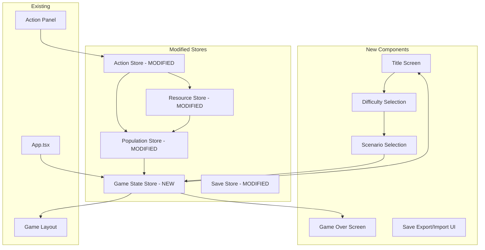

# Design Document: 游戏改进 (Game Improvements)

## Overview

本设计文档描述《尘埃与回响》游戏的改进实现方案，包括行动系统修复、存档导入导出UI、资源短缺死亡机制、开始/结算画面、难度选择系统和开局选择界面。

### 核心设计原则

1. **最小改动原则**: 尽量复用现有代码和组件
2. **状态驱动**: 使用Zustand管理游戏状态，UI响应状态变化
3. **类型安全**: 所有新增功能使用TypeScript严格类型
4. **复古终端风格**: 保持现有的琥珀色终端UI风格

## Architecture

### 系统架构变更



## Components and Interfaces

### 新增类型定义

```typescript
// 游戏状态
type GameState = 'title' | 'new_game' | 'playing' | 'paused' | 'game_over';

// 难度等级
type DifficultyLevel = 'easy' | 'normal' | 'hard';

// 难度配置
interface DifficultyConfig {
  id: DifficultyLevel;
  name: string;
  nameZh: string;
  description: string;
  descriptionZh: string;
  modifiers: {
    consumptionMultiplier: number;  // 资源消耗倍率
    startingResourceMultiplier: number;  // 初始资源倍率
    eventDangerMultiplier: number;  // 事件危险倍率
  };
}

// 开局场景
interface StartingScenario {
  id: string;
  name: string;
  nameZh: string;
  description: string;
  descriptionZh: string;
  startingWorkers: number;
  startingResources: Partial<Record<ResourceId, number>>;
}

// 游戏统计
interface GameStatistics {
  daysSurvived: number;
  totalResourcesGathered: number;
  workersLost: number;
  buildingsConstructed: number;
  causeOfDeath?: string;
}

// 游戏设置（扩展）
interface GameSettings {
  autoSaveInterval: number;
  language: 'zh' | 'en';
  soundEnabled: boolean;
  musicEnabled: boolean;
  difficulty: DifficultyLevel;
  scenario: string;
}
```

### 新增Store: gameStateStore

```typescript
interface GameStateStore {
  // 状态
  gameState: GameState;
  difficulty: DifficultyLevel;
  scenario: string;
  statistics: GameStatistics;
  
  // 状态转换
  setGameState: (state: GameState) => void;
  startNewGame: (difficulty: DifficultyLevel, scenario: string) => void;
  continueGame: () => void;
  triggerGameOver: (cause: string) => void;
  returnToTitle: () => void;
  
  // 统计更新
  incrementDaysSurvived: () => void;
  addResourcesGathered: (amount: number) => void;
  incrementWorkersLost: () => void;
  incrementBuildingsConstructed: () => void;
  
  // 难度获取
  getDifficultyModifiers: () => DifficultyConfig['modifiers'];
  
  // 重置
  resetStatistics: () => void;
}
```

### 修改ActionPanel组件

```typescript
// ActionPanel.tsx 修改
interface ActionPanelProps {
  onEndPhase?: () => void;
  onExecuteAction?: (actionId: ActionId) => void;  // 新增
  className?: string;
}

// 行动执行回调连接到实际的store操作
const handleExecuteAction = (actionId: ActionId) => {
  const context = getActionContext();
  const result = executeAction(
    actionId,
    context,
    (changes) => consumeResources(changes),
    (changes) => addResources(changes)
  );
  
  if (result.success) {
    addEventLog(result.messageZh);
  } else {
    addEventLog(`行动失败: ${result.messageZh}`);
  }
  
  onExecuteAction?.(actionId);
};
```

## Data Models

### 难度配置数据

```typescript
const DIFFICULTY_CONFIGS: Record<DifficultyLevel, DifficultyConfig> = {
  easy: {
    id: 'easy',
    name: 'Easy',
    nameZh: '简单',
    description: 'Reduced consumption, more starting resources',
    descriptionZh: '降低消耗，更多初始资源',
    modifiers: {
      consumptionMultiplier: 0.8,
      startingResourceMultiplier: 1.5,
      eventDangerMultiplier: 0.7,
    },
  },
  normal: {
    id: 'normal',
    name: 'Normal',
    nameZh: '普通',
    description: 'Standard survival experience',
    descriptionZh: '标准生存体验',
    modifiers: {
      consumptionMultiplier: 1.0,
      startingResourceMultiplier: 1.0,
      eventDangerMultiplier: 1.0,
    },
  },
  hard: {
    id: 'hard',
    name: 'Hard',
    nameZh: '困难',
    description: 'Increased consumption, fewer starting resources',
    descriptionZh: '增加消耗，更少初始资源',
    modifiers: {
      consumptionMultiplier: 1.2,
      startingResourceMultiplier: 0.7,
      eventDangerMultiplier: 1.3,
    },
  },
};
```

### 开局场景配置数据

```typescript
const STARTING_SCENARIOS: StartingScenario[] = [
  {
    id: 'lone_survivor',
    name: 'Lone Survivor',
    nameZh: '孤独幸存者',
    description: 'One worker with balanced resources',
    descriptionZh: '独自一人，资源均衡',
    startingWorkers: 1,
    startingResources: {
      scrap: 25,
      water: 12,
      food: 12,
      dirty_water: 5,
    },
  },
  {
    id: 'scavenger',
    name: 'Scavenger',
    nameZh: '废墟拾荒者',
    description: 'Two workers, rich in scrap but low on supplies',
    descriptionZh: '两人小队，废料丰富但补给紧张',
    startingWorkers: 2,
    startingResources: {
      scrap: 40,
      water: 6,
      food: 6,
      dirty_water: 10,
      wood: 5,
    },
  },
  {
    id: 'shelter_remnant',
    name: 'Shelter Remnant',
    nameZh: '避难所遗民',
    description: 'Two workers with good supplies but little materials',
    descriptionZh: '两人小队，补给充足但材料匮乏',
    startingWorkers: 2,
    startingResources: {
      scrap: 10,
      water: 20,
      food: 20,
      canned_food: 5,
    },
  },
];
```

## Component Designs

### TitleScreen 组件

```typescript
function TitleScreen() {
  const hasSave = useSaveStore(state => state.hasSave());
  const setGameState = useGameStateStore(state => state.setGameState);
  const continueGame = useGameStateStore(state => state.continueGame);
  
  return (
    <div className="min-h-screen bg-terminal-bg flex flex-col items-center justify-center">
      {/* 标题 */}
      <h1 className="text-4xl text-terminal-amber font-mono mb-2">
        尘埃与回响
      </h1>
      <p className="text-terminal-dim text-sm mb-12">
        DUST & ECHOES
      </p>
      
      {/* 按钮组 */}
      <div className="flex flex-col gap-4 w-64">
        <Button onClick={() => setGameState('new_game')}>
          新游戏
        </Button>
        <Button 
          onClick={continueGame} 
          disabled={!hasSave}
          variant={hasSave ? 'primary' : 'secondary'}
        >
          继续游戏
        </Button>
        <Button variant="secondary">
          设置
        </Button>
      </div>
      
      {/* 氛围文字 */}
      <p className="text-terminal-dim text-xs mt-16 max-w-md text-center">
        在这片废土上，生存是唯一的法则。
        每一滴水，每一口食物，都可能决定你的命运。
      </p>
    </div>
  );
}
```

### GameOverScreen 组件

```typescript
function GameOverScreen() {
  const statistics = useGameStateStore(state => state.statistics);
  const returnToTitle = useGameStateStore(state => state.returnToTitle);
  const startNewGame = useGameStateStore(state => state.startNewGame);
  
  return (
    <div className="min-h-screen bg-terminal-bg flex flex-col items-center justify-center">
      {/* 标题 */}
      <h1 className="text-3xl text-terminal-red font-mono mb-4">
        终 结
      </h1>
      
      {/* 死因 */}
      <p className="text-terminal-amber mb-8">
        {statistics.causeOfDeath || '所有幸存者已死亡'}
      </p>
      
      {/* 统计 */}
      <div className="bg-terminal-bg border border-terminal-amber/30 p-6 mb-8">
        <h2 className="text-terminal-amber mb-4">生存记录</h2>
        <div className="text-terminal-dim space-y-2">
          <p>存活天数: {statistics.daysSurvived}</p>
          <p>收集资源: {statistics.totalResourcesGathered} VU</p>
          <p>失去同伴: {statistics.workersLost}</p>
          <p>建造设施: {statistics.buildingsConstructed}</p>
        </div>
      </div>
      
      {/* 按钮 */}
      <div className="flex gap-4">
        <Button onClick={() => startNewGame('normal', 'lone_survivor')}>
          重新开始
        </Button>
        <Button variant="secondary" onClick={returnToTitle}>
          返回标题
        </Button>
      </div>
    </div>
  );
}
```

### SaveExportUI 组件

```typescript
function SaveExportUI() {
  const downloadSave = useSaveStore(state => state.downloadSave);
  const importFromFile = useSaveStore(state => state.importFromFile);
  const collectGameState = useCallback(() => collectGameState(), []);
  const fileInputRef = useRef<HTMLInputElement>(null);
  
  const handleExport = () => {
    downloadSave(collectGameState);
  };
  
  const handleImport = async (e: ChangeEvent<HTMLInputElement>) => {
    const file = e.target.files?.[0];
    if (file) {
      const saveData = await importFromFile(file);
      if (saveData) {
        restoreGameState(saveData);
        // 显示成功消息
      }
    }
  };
  
  return (
    <div className="flex gap-2">
      <Button size="sm" onClick={handleExport}>
        导出存档
      </Button>
      <Button size="sm" onClick={() => fileInputRef.current?.click()}>
        导入存档
      </Button>
      <input
        ref={fileInputRef}
        type="file"
        accept=".json"
        onChange={handleImport}
        className="hidden"
      />
    </div>
  );
}
```


### DifficultySelect 组件

```typescript
function DifficultySelect({ onSelect }: { onSelect: (difficulty: DifficultyLevel) => void }) {
  return (
    <div className="min-h-screen bg-terminal-bg flex flex-col items-center justify-center">
      <h2 className="text-2xl text-terminal-amber font-mono mb-8">选择难度</h2>
      
      <div className="flex flex-col gap-4 w-80">
        {Object.values(DIFFICULTY_CONFIGS).map((config) => (
          <button
            key={config.id}
            onClick={() => onSelect(config.id)}
            className="border border-terminal-amber/50 p-4 hover:bg-terminal-amber/10"
          >
            <div className="text-terminal-amber text-lg">{config.nameZh}</div>
            <div className="text-terminal-dim text-sm">{config.descriptionZh}</div>
          </button>
        ))}
      </div>
    </div>
  );
}
```

### ScenarioSelect 组件

```typescript
function ScenarioSelect({ onSelect }: { onSelect: (scenarioId: string) => void }) {
  return (
    <div className="min-h-screen bg-terminal-bg flex flex-col items-center justify-center">
      <h2 className="text-2xl text-terminal-amber font-mono mb-8">选择开局</h2>
      
      <div className="flex flex-col gap-4 w-96">
        {STARTING_SCENARIOS.map((scenario) => (
          <button
            key={scenario.id}
            onClick={() => onSelect(scenario.id)}
            className="border border-terminal-amber/50 p-4 hover:bg-terminal-amber/10 text-left"
          >
            <div className="text-terminal-amber text-lg">{scenario.nameZh}</div>
            <div className="text-terminal-dim text-sm mb-2">{scenario.descriptionZh}</div>
            <div className="text-terminal-dim text-xs">
              工人: {scenario.startingWorkers} | 
              废料: {scenario.startingResources.scrap || 0} | 
              水: {scenario.startingResources.water || 0} | 
              食物: {scenario.startingResources.food || 0}
            </div>
          </button>
        ))}
      </div>
    </div>
  );
}
```

### 资源短缺死亡逻辑

```typescript
// gameIntegration.ts 中的修改
function processResourceShortage(shortageResult: ShortageResult): void {
  const { waterShortage, foodShortage } = shortageResult;
  const workers = usePopulationStore.getState().workers;
  
  // 计算总伤害
  const waterDamage = waterShortage * 10;  // 10 HP per AU of water shortage
  const foodDamage = foodShortage * 8;     // 8 HP per AU of food shortage
  const totalDamage = waterDamage + foodDamage;
  
  if (totalDamage <= 0) return;
  
  // 按健康值排序，最低的先受伤
  const sortedWorkers = [...workers].sort((a, b) => a.health - b.health);
  
  for (const worker of sortedWorkers) {
    const newHealth = Math.max(0, worker.health - totalDamage);
    usePopulationStore.getState().modifyWorkerHealth(worker.id, newHealth - worker.health);
    
    if (newHealth === 0) {
      // 工人死亡
      usePopulationStore.getState().removeWorker(worker.id);
      useGameStateStore.getState().incrementWorkersLost();
      
      const cause = waterShortage > foodShortage ? '脱水' : '饥饿';
      useEventStore.getState().addEvent({
        type: 'death',
        message: `${worker.name} 因${cause}而死亡`,
        messageZh: `${worker.name} 因${cause}而死亡`,
      });
    }
  }
  
  // 检查游戏结束
  if (usePopulationStore.getState().workers.length === 0) {
    useGameStateStore.getState().triggerGameOver('所有幸存者已死亡');
  }
}
```

## Correctness Properties

*A property is a characteristic or behavior that should hold true across all valid executions of a system—essentially, a formal statement about what the system should do. Properties serve as the bridge between human-readable specifications and machine-verifiable correctness guarantees.*

### Property 1: Action Execution Updates State

*For any* valid action with sufficient resources, executing the action SHALL result in:
- Resources being consumed according to action cost
- AU being decremented by action duration
- Event log containing the action result

**Validates: Requirements 1.1, 1.2, 1.4, 1.5**

### Property 2: Invalid Action Rejection

*For any* action execution attempt that fails validation (insufficient resources, insufficient AU, or unmet prerequisites), the action SHALL be rejected and:
- No resources shall be consumed
- An error message shall be displayed

**Validates: Requirements 1.3**

### Property 3: Save Round-Trip Consistency

*For any* valid game state, exporting to JSON then importing SHALL restore an equivalent game state with:
- Same resources
- Same workers
- Same difficulty setting
- Same game statistics

**Validates: Requirements 2.4, 2.5, 2.6**

### Property 4: Resource Shortage Health Damage

*For any* resource shortage event:
- Water shortage of N AU SHALL reduce worker health by N * 10
- Food shortage of N AU SHALL reduce worker health by N * 8
- Damage SHALL be applied to lowest-health workers first

**Validates: Requirements 3.1, 3.2, 3.6**

### Property 5: Worker Death on Zero Health

*For any* worker whose health reaches 0:
- The worker SHALL be removed from the population
- A death event SHALL be logged
- Workers lost statistic SHALL increment

**Validates: Requirements 3.3, 3.4**

### Property 6: Game Over on Total Population Loss

*For any* game state where worker count reaches 0:
- Game state SHALL transition to 'game_over'
- Statistics SHALL be preserved for display

**Validates: Requirements 5.1, 8.4**

### Property 7: Scenario Initialization

*For any* selected scenario, starting a new game SHALL initialize:
- Worker count matching scenario.startingWorkers
- Resources matching scenario.startingResources (modified by difficulty multiplier)

**Validates: Requirements 7.3**

### Property 8: Game State Screen Mapping

*For any* game state value, the UI SHALL render the corresponding screen:
- 'title' → TitleScreen
- 'new_game' → DifficultySelect/ScenarioSelect
- 'playing' → GameLayout
- 'game_over' → GameOverScreen

**Validates: Requirements 8.2**

### Property 9: Statistics Tracking

*For any* gameplay session, statistics SHALL accurately track:
- Days survived (incremented each day)
- Resources gathered (sum of all resource additions)
- Workers lost (count of deaths)
- Buildings constructed (count of constructions)

**Validates: Requirements 8.3, 8.4**

### Property 10: Title Screen Continue Button State

*For any* title screen render:
- Continue button SHALL be enabled if and only if a valid save exists

**Validates: Requirements 4.3**

## Error Handling

### Action System Errors

| Error Condition | Handling | User Feedback |
|----------------|----------|---------------|
| Insufficient resources | Reject action, no state change | "资源不足: 需要 X 单位 [资源名]" |
| Insufficient AU | Reject action, no state change | "行动点不足: 需要 X AU" |
| Prerequisites not met | Reject action, no state change | "前置条件未满足: [条件描述]" |
| Worker unavailable | Reject action, no state change | "没有可用的工人" |

### Save System Errors

| Error Condition | Handling | User Feedback |
|----------------|----------|---------------|
| Invalid JSON format | Reject import | "存档格式无效" |
| Missing required fields | Reject import | "存档数据不完整" |
| Version mismatch | Attempt migration or reject | "存档版本不兼容" |
| File read error | Reject import | "无法读取文件" |

### Resource Shortage Handling

| Condition | Handling |
|-----------|----------|
| Water = 0, consumption needed | Apply 10 HP damage per AU shortage |
| Food = 0, consumption needed | Apply 8 HP damage per AU shortage |
| Worker health = 0 | Remove worker, log death event |
| All workers dead | Trigger game over |

## Testing Strategy

### Testing Framework

- **Unit Testing**: Vitest (already configured in project)
- **Property-Based Testing**: fast-check library
- **Component Testing**: React Testing Library

### Unit Tests

Unit tests will cover specific examples and edge cases:

1. **Action System**
   - Test specific action execution with known inputs
   - Test validation failure cases
   - Test AU consumption tracking

2. **Save System**
   - Test export generates valid JSON
   - Test import with valid save data
   - Test import rejection with invalid data

3. **Resource Shortage**
   - Test health damage calculation
   - Test worker death at health = 0
   - Test damage ordering by health

4. **Game State**
   - Test state transitions
   - Test statistics updates
   - Test game over trigger

### Property-Based Tests

Property tests will verify universal properties across generated inputs:

1. **Property 1 Test**: Generate random valid actions and verify state updates correctly
   - **Feature: game-improvements, Property 1: Action Execution Updates State**
   - Minimum 100 iterations

2. **Property 3 Test**: Generate random game states and verify save round-trip
   - **Feature: game-improvements, Property 3: Save Round-Trip Consistency**
   - Minimum 100 iterations

3. **Property 4 Test**: Generate random shortage amounts and verify damage calculation
   - **Feature: game-improvements, Property 4: Resource Shortage Health Damage**
   - Minimum 100 iterations

4. **Property 7 Test**: Generate scenario selections and verify initialization
   - **Feature: game-improvements, Property 7: Scenario Initialization**
   - Minimum 100 iterations

### Test File Organization

```
dust-and-echoes/src/
├── store/
│   ├── gameStateStore.ts
│   ├── gameStateStore.test.ts      # Unit + Property tests
│   ├── actionStore.test.ts         # Add action execution tests
│   └── saveStore.test.ts           # Add round-trip property tests
├── components/
│   └── screens/
│       ├── TitleScreen.test.tsx    # Component tests
│       └── GameOverScreen.test.tsx # Component tests
└── config/
    ├── difficulty.ts
    ├── difficulty.test.ts          # Config validation tests
    ├── scenarios.ts
    └── scenarios.test.ts           # Config validation tests
```
