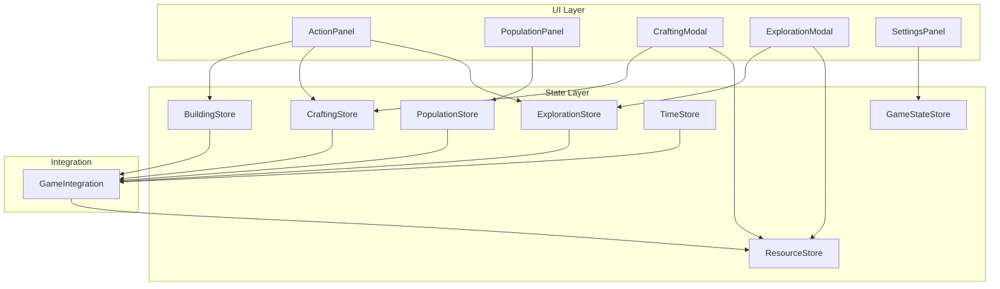

# Design Document: Gameplay Fixes

## Overview

本设计文档描述了《尘埃与回响》游戏的五个核心功能修复：建筑功能、工人分配、制造系统、探索功能和AU自动进阶。这些修复旨在确保游戏核心循环正常运作。

## Architecture

### 系统架构图



### 数据流

1. **建筑效果流**: BuildingStore → GameIntegration → PopulationStore/ResourceStore
2. **工人分配流**: UI → PopulationStore (无AU消耗)
3. **制造流**: CraftingModal → CraftingStore → ResourceStore (确认后消耗AU)
4. **探索流**: ExplorationModal → ExplorationStore → ResourceStore
5. **自动进阶流**: ActionStore → TimeStore → GameIntegration

## Components and Interfaces

### 1. 建筑效果同步器 (BuildingEffectSynchronizer)

```typescript
interface BuildingEffectSynchronizer {
  // 当建筑等级变化时同步所有效果
  syncBuildingEffects(buildingId: BuildingId, newLevel: number): void;
  
  // 同步人口上限
  syncPopulationCap(): void;
  
  // 同步存储上限
  syncStorageCaps(): void;
  
  // 同步岗位槽位
  syncJobSlots(): void;
  
  // 同步探索区域
  syncExplorationRegions(): void;
}
```

### 2. 工人分配接口 (WorkerAssignment)

```typescript
interface WorkerAssignmentService {
  // 分配工人到岗位（不消耗AU）
  assignWorker(workerId: string, jobId: JobId): AssignmentResult;
  
  // 取消工人分配
  unassignWorker(workerId: string): boolean;
  
  // 检查工人是否可分配
  canAssignWorker(workerId: string, jobId: JobId): { canAssign: boolean; reason?: string };
  
  // 获取岗位可用槽位
  getAvailableSlots(jobId: JobId): number;
}

interface AssignmentResult {
  success: boolean;
  reason?: string;
  auConsumed: 0; // 始终为0
}
```

### 3. 制造菜单接口 (CraftingMenu)

```typescript
interface CraftingMenuState {
  isOpen: boolean;
  selectedRecipe: RecipeId | null;
  quantity: number;
  
  // 打开制造菜单
  openMenu(): void;
  
  // 选择配方
  selectRecipe(recipeId: RecipeId): void;
  
  // 设置数量
  setQuantity(quantity: number): void;
  
  // 确认制造（此时消耗AU和资源）
  confirmCraft(): CraftResult;
  
  // 取消
  cancel(): void;
}

interface CraftResult {
  success: boolean;
  outputResourceId: ResourceId;
  outputAmount: number;
  auConsumed: number;
  materialsConsumed: ResourceAmount[];
  workConsumed: number;
}
```

### 4. 探索菜单接口 (ExplorationMenu)

```typescript
interface ExplorationMenuState {
  isOpen: boolean;
  selectedNode: MapNode | null;
  selectedWorkers: string[];
  
  // 打开探索菜单
  openMenu(): void;
  
  // 获取可探索节点
  getAvailableNodes(): MapNode[];
  
  // 选择节点
  selectNode(nodeId: string): void;
  
  // 选择工人
  selectWorkers(workerIds: string[]): void;
  
  // 获取探索预览
  getPreview(): ExplorationPreview;
  
  // 确认探索
  confirmExploration(): ExpeditionResult;
}
```

### 5. 自动进阶设置 (AutoAdvanceSettings)

```typescript
interface AutoAdvanceSettings {
  // 是否启用自动进阶
  autoAdvanceEnabled: boolean;
  
  // 切换自动进阶
  toggleAutoAdvance(): void;
  
  // 检查是否应该自动进阶
  shouldAutoAdvance(remainingAU: number): boolean;
  
  // 执行自动进阶
  performAutoAdvance(): void;
}
```

## Data Models

### 建筑效果数据

```typescript
interface BuildingEffect {
  type: 'unlock_job' | 'unlock_region' | 'unlock_recipe' | 'population_cap' | 'storage_cap';
  value: string | number;
  buildingId: BuildingId;
  level: number;
}
```

### 游戏设置数据

```typescript
interface GameSettings {
  autoAdvanceEnabled: boolean;
  // 其他设置...
}
```

### 制造任务数据

```typescript
interface CraftingTask {
  recipeId: RecipeId;
  quantity: number;
  materialsRequired: ResourceAmount[];
  workRequired: number;
  auCost: number;
  status: 'preview' | 'confirmed' | 'completed';
}
```

## Correctness Properties

*A property is a characteristic or behavior that should hold true across all valid executions of a system-essentially, a formal statement about what the system should do. Properties serve as the bridge between human-readable specifications and machine-verifiable correctness guarantees.*

### Property 1: Building Effect Synchronization
*For any* building at level L, all building effects for that level SHALL be active in the corresponding systems (population cap, storage cap, job slots, exploration regions).
**Validates: Requirements 1.1, 1.2, 1.3, 1.4, 1.5, 1.6, 1.7, 6.1**

### Property 2: Worker Assignment AU Invariant
*For any* worker assignment operation, the AU consumed SHALL always be exactly 0.
**Validates: Requirements 2.2**

### Property 3: Worker Assignment State Consistency
*For any* worker assigned to job J, worker.job SHALL equal J, and *for any* worker unassigned, worker.job SHALL be null.
**Validates: Requirements 2.5, 2.6**

### Property 4: Job Slot Validation
*For any* job J with max slots S and current workers C, if C >= S then new assignments to J SHALL fail.
**Validates: Requirements 2.3**

### Property 5: Crafting Resource Round-Trip
*For any* successful crafting operation with recipe R and quantity Q, the system SHALL consume exactly R.inputs × Q materials, R.workCost × Q work points, and produce exactly R.output × Q items.
**Validates: Requirements 3.6, 3.7, 3.9**

### Property 6: Exploration Node Accessibility
*For any* exploration attempt, if radio tower level is 0, only T1 nodes SHALL be accessible; if level is L > 0, nodes up to distance getMaxExplorationDistance(L) SHALL be accessible.
**Validates: Requirements 4.2, 4.10**

### Property 7: Exploration Lifecycle
*For any* completed expedition to node N, the system SHALL have consumed the required supplies, generated loot based on N.tier, and updated N.state to 'explored'.
**Validates: Requirements 4.6, 4.7, 4.8, 4.9**

### Property 8: Auto-Advance Behavior
*For any* phase where auto-advance is enabled AND remaining AU equals 0, the system SHALL automatically advance to the next phase and process all phase-end calculations.
**Validates: Requirements 5.2, 5.3**

### Property 9: Auto-Advance Setting Persistence
*For any* save/load cycle, the auto-advance setting value SHALL be preserved.
**Validates: Requirements 5.7**

### Property 10: Building-Dependent System Sync
*For any* building level change, all dependent systems (population cap, storage cap, job slots) SHALL reflect the new values within the same game tick.
**Validates: Requirements 6.1, 6.2, 6.3, 6.4**

## Error Handling

### 建筑系统错误
- 资源不足时显示缺少的资源类型和数量
- 科技前置未满足时显示所需科技名称
- 已达最大等级时禁用升级按钮

### 工人分配错误
- 岗位已满时显示"岗位已满"
- 工人无法工作时显示原因（健康过低/流血状态）
- 建筑未建造时显示"需要先建造[建筑名]"

### 制造系统错误
- 材料不足时高亮显示缺少的材料
- Work不足时显示当前/所需Work值
- 工坊未建造时显示"需要先建造工坊"

### 探索系统错误
- 补给不足时显示所需补给量
- 无可用工人时显示"没有可派遣的工人"
- 已有探险队时显示"探险队正在执行任务"

### 自动进阶错误
- 设置保存失败时显示错误提示
- 自动进阶触发失败时回退到手动模式

## Testing Strategy

### 单元测试

1. **BuildingStore 测试**
   - 测试建筑升级后效果立即生效
   - 测试人口上限计算公式
   - 测试存储上限计算

2. **PopulationStore 测试**
   - 测试工人分配不消耗AU
   - 测试岗位槽位验证
   - 测试工人状态更新

3. **CraftingStore 测试**
   - 测试制造资源消耗
   - 测试Work点数消耗
   - 测试产出计算

4. **ExplorationStore 测试**
   - 测试节点可访问性
   - 测试补给消耗计算
   - 测试战利品生成

5. **GameStateStore 测试**
   - 测试自动进阶设置
   - 测试设置持久化

### 属性测试 (Property-Based Testing)

使用 fast-check 库进行属性测试，每个属性测试运行至少100次迭代。

测试标签格式: **Feature: gameplay-fixes, Property {number}: {property_text}**

### 集成测试

1. **建筑-岗位集成**
   - 建造生产建筑后岗位槽位正确更新

2. **制造-资源集成**
   - 制造完成后资源正确增减

3. **探索-资源集成**
   - 探索完成后战利品正确添加

4. **自动进阶-阶段集成**
   - AU耗尽后正确触发阶段切换
